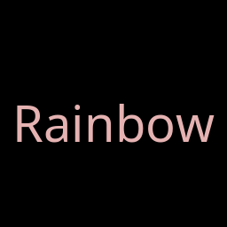
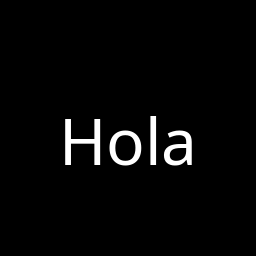
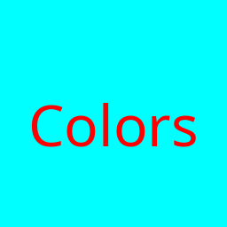

# Mr. Worldwide 🌎

Mr. Worldwide is a Python tool that generates animated GIFs of a single word translated into many languages, each displayed against a culturally relevant background image.


## Project Structure

The project is organized as follows:

- `src/`: Core logic and main script.
  - `mr_worldwide.py`: The main CLI tool.
  - `download_assets.py`: Script to download initial images.
  - `analyze_flags.py`: Script to extract colors from SVG flags.
- `tests/`: Validation and test scripts.
- `examples/`: Example scripts and generated GIFs.
  - `permutations/`: Scripts for every CLI option permutation.
  - `demos/`: Pre-generated demo GIFs.
  - `outputs/`: GIFs generated from the permutation scripts.
- `fonts/`: Unicode-compliant Noto fonts.
- `hello_assets/` / `love_assets/`: Background images organized by country.

## Installation

1.  **Clone the repository**:
    ```bash
    git clone https://github.com/enrique/mr.worldwide.git
    cd mr.worldwide
    ```

2.  **Run the setup script**:
    This script creates a virtual environment, installs dependencies, and downloads the necessary Unicode fonts.
    ```bash
    bash setup.sh
    source venv/bin/activate
    ```

3.  **(Optional) Download assets**:
    Download some initial background images from Wikimedia Commons:
    ```bash
    python3 src/download_assets.py
    ```

## Usage

### Basic Example
Generate a simple GIF with a solid background:
```bash
python3 src/mr_worldwide.py --text "Hello" --size "512,512" --delay 500
```

### Mr. Worldwide Mode (The Full Experience)
Generate a GIF with background images, smart colors, and regional ordering:
```bash
python3 src/mr_worldwide.py --text "Love" --use_icons --smart_color --delay 500 --gif_path "love_worldwide.gif"
```

## CLI Permutations Gallery

Every significant combination of CLI flags is documented below. You can run these yourself using the scripts in `examples/permutations/`.

### 🌟 Visual Styles

| Feature | Preview | CLI Syntax |
| :--- | :--- | :--- |
| **Flag Colors** |  | `--use_flag_colors` |
| **Rainbow Effect** |  | `--rainbow` |
| **Smart Contrast** |  | `--use_icons --smart_color` |
| **Icons Mode** |  | `--use_icons` |
| **Basic Text** |  | `--text "Hello"` |

### 🛠 Layout & Timing

| Feature | Preview | CLI Syntax |
| :--- | :--- | :--- |
| **Sine Focus** |  | `--sine_delay 1000 --delay 100` |
| **Size & Delay** |  | `--size "512,128" --delay 500` |
| **Text Array** |  | `--text_array "Hola, Hello, ..."` |
| **Custom Colors** |  | `--font_color "255,0,0" --background_color "0,255,255"` |

### 🌍 Combined Modes

| Feature | Preview | CLI Syntax |
| :--- | :--- | :--- |
| **Full Package** |  | `--use_icons --smart_color --use_flag_colors` |
| **Icons + Rainbow** |  | `--use_icons --rainbow` |
| **Icons + Flags** |  | `--use_icons --use_flag_colors` |

## Advanced Options

| Option | Description | Default |
| :--- | :--- | :--- |
| `--text` | The word to translate (e.g., "Hello", "Love"). | `None` |
| `--text_array` | A comma-separated list of custom strings. | `None` |
| `--use_icons` | Enable country-specific background images. | `False` |
| `--smart_color` | Pick high-contrast text colors automatically. | `False` |
| `--rainbow` | Apply a shifting rainbow effect to the text. | `False` |
| `--use_flag_colors` | Color the text based on the country's flag. | `False` |
| `--size` | Image dimensions in `width,height`. | `256,256` |
| `--delay` | Time between frames in milliseconds. | `100` |
| `--sine_delay` | Focus on each frame for N ms in a loop. | `0` |
| `--languages` | List of ISO codes or `all`. | `all` |
| `--font_path` | Path to a custom TTF/OTF font file. | `fonts/NotoSans-Regular.ttf` |

## Requirements

- Python 3.12+
- Pillow
- NumPy
- SciPy

*Note: Setup script handles most of these automatically.*
